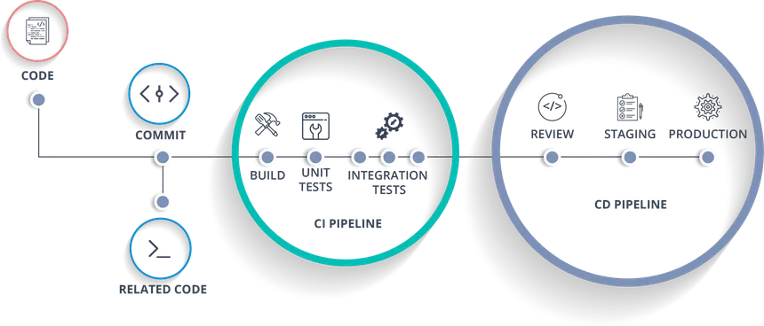

## GitHub Actions CI/CD Workflow Details

This project uses a GitHub Actions workflow for continuous integration and testing, defined in `.github/workflows/workflow.yml`. Below is a detailed explanation of how the workflow operates and what each step does.

### Workflow Triggers

- **on.push / on.pull_request:**  
  The workflow is triggered automatically on every push or pull request to the `main` and `dev` branches. This ensures that all code changes are tested before being merged or deployed.

---

### Job: tests

#### 1. Runner

- **runs-on: ubuntu-latest**  
  The workflow runs on the latest Ubuntu virtual environment provided by GitHub Actions.

#### 2. MySQL Service

- **services.mysql**  
  - **image:** Uses the official `mysql:8.0` Docker image.
  - **ports:** Exposes port `3306` for database connections.
  - **env:** Sets up the root password and creates a database named `test_db`.
  - **options:** Adds a health check to ensure MySQL is ready before running tests.

---

#### 3. Steps

- **Checkout code**  
  `actions/checkout@v4`  
  Checks out your repository code so the workflow can access it.

- **Setup PHP with PECL extension**  
  `shivammathur/setup-php@v2`  
  Installs PHP version 8.4 and the following extensions required by Laravel and many of its packages:  
  `mbstring, bcmath, ctype, fileinfo, json, tokenizer, xml, pdo, pdo_mysql, openssl, curl, zip, imagick, swoole`

- **Cache Composer dependencies**  
  `actions/cache@v4`  
  Caches the `vendor` directory based on the `composer.lock` file. This speeds up subsequent workflow runs by reusing previously installed dependencies if they haven't changed.

- **Copy .env file**  
  Copies `.env.ci` to `.env` to set up environment variables specifically for the CI environment. This allows you to have different settings for testing than for local development or production.

- **Install dependencies**  
  Runs `composer install` with flags to make the installation quiet, non-interactive, and optimized for CI. This installs all PHP dependencies required by your Laravel application.

- **Generate application key**  
  Runs `php artisan key:generate` to set the Laravel application key, which is required for encryption and session management.

- **Directory permissions**  
  Sets the correct ownership and permissions for the `storage` and `bootstrap/cache` directories. Laravel needs write access to these directories for caching and logging.

- **phpstan (Static Analysis)**  
  Runs PHPStan at level 5 to perform static analysis on your codebase. This helps catch potential bugs and code issues early.

- **phpinsights (Code Quality)**  
  Runs PHP Insights to analyze code quality, complexity, architecture, and style. The workflow enforces minimum thresholds for each metric, helping maintain high code standards.

- **Run tests**  
  Executes the Laravel test suite using `php artisan test`. This runs all your automated tests to ensure your application behaves as expected.

---

### Smart Caching

The workflow uses smart caching for Composer dependencies:
- The `vendor` directory is cached based on the hash of your `composer.lock` file.
- If dependencies haven’t changed, the cache is restored, making `composer install` much faster.
- This reduces bandwidth and resource usage on repeated CI runs.

---

### Summary

This workflow ensures that every code change is automatically:
- Checked out and set up in a fresh environment
- Tested against a real MySQL database
- Analyzed for code quality and potential issues
- Verified by running the full test suite

By automating these steps, the workflow helps maintain code quality, catch bugs early, and streamline the development process.
